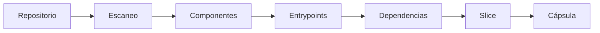

# RepoSlice

Motor de análisis arquitectónico y slicing de repositorios que descubre estructura, relaciona componentes y permite extraer porciones funcionales como cápsulas verificables.

[](https://www.rust-lang.org/)
[](https://www.typescriptlang.org/)
[](https://react.dev/)
[](https://tauri.app/)
[](LICENSE)

## Preview

<!-- Agregar capturas de la aplicación Desktop aquí cuando estén disponibles -->

## ¿Qué es RepoSlice?

RepoSlice es una herramienta de análisis estático que examina repositorios de software para construir un modelo universal de sus tecnologías, componentes, puntos de entrada y dependencias. A partir de ese modelo permite explorar un proyecto, relacionar servicios dentro de un workspace y crear cápsulas de código trazables para revisar o compartir una parte concreta del sistema.

El proyecto está compuesto por un motor Rust reutilizable, una CLI y una aplicación Desktop basada en Tauri + React. El motor analiza repositorios sin ejecutar el código, descubre unidades de proyecto en monorepositorios, detecta frameworks y produce un grafo de relaciones que puede ser exportado, inspectado y utilizado para crear cápsulas verificables.

RepoSlice está orientado a desarrolladores, arquitectos de software, tech leads y equipos de modernización que necesitan analizar repositorios grandes, monorepos o sistemas distribuidos en múltiples repositorios. También está diseñado para herramientas y agentes que requieren contexto reducido de código.

## ¿Qué problema resuelve?

Analizar repositorios grandes donde una tarea concreta puede involucrar únicamente una pequeña parte del código es un desafío común. RepoSlice resuelve este problema proporcionando un flujo estructurado que va desde el análisis del repositorio completo hasta la generación de cápsulas verificables.



El motor descubre automáticamente la estructura del proyecto, identifica tecnologías y frameworks, extrae componentes y sus relaciones, y permite calcular qué necesita un componente específico (slice) o qué componentes dependen de él (impacto). Esto facilita la comprensión de arquitecturas complejas y la extracción de porciones funcionales de código de forma trazable.

## Capacidades principales

- Detecta lenguajes, frameworks y archivos de configuración.
- Extrae componentes, símbolos, entrypoints, rutas HTTP y dependencias internas.
- Descubre unidades de proyecto en monorepositorios.
- Modela relaciones entre repositorios y unidades de un workspace mediante HTTP y dependencias de paquetes compartidos.
- Calcula el corte de dependencias de un componente o entrypoint y el impacto inverso de sus consumidores.
- Crea cápsulas de uno o varios repositorios con manifiesto y procedencia.
- Excluye archivos sensibles y verifica integridad de contenido, inventario, portabilidad y seguridad de symlinks en las cápsulas.
- Detecta runtimes locales como Node.js, Java, Python, PHP, Docker, Go y Rust.
- Expone la misma lógica a través de un SDK Rust, la CLI y la aplicación Desktop.
- Conserva snapshots SHA-256 de la evolución del workspace y permite comparar cambios estructurales entre análisis.
- Exporta el modelo del workspace a JSON, Mermaid y GraphML.
- Genera contexto acotado para agentes y ofrece un servidor MCP local, loopback-only y de solo lectura.
- Persiste una auditoría del último análisis por repositorio con estado, duración, commit, firma del registro de analizadores, fingerprint del modelo, cobertura, diagnósticos e integridad del grafo.
- Usa iconos tecnológicos SVG locales y funciona sin depender de CDN externos.
- Mantiene interfaz ES/EN y localiza diagnósticos conocidos por código sin alterar identificadores técnicos.
- Acelera reanálisis mediante dos niveles de caché: caché interna del scanner y un `WorkspaceModel` persistente e incremental por repositorio, invalidado por commit/estado Git, cambios locales, firma de analizadores y versión del motor.

## Tecnologías soportadas

| Categoría | Tecnologías |
| --- | --- |
| **Backend** | Java, Spring Boot, PHP, Laravel, Symfony, Django, FastAPI, Flask, ASP.NET, Blazor, Rails, Go Web, Rust Web, Quarkus, Micronaut, Ktor, Phoenix |
| **Frontend** | TypeScript/JavaScript, Angular, React, Next.js, Vue, Nuxt, Svelte, SvelteKit, Astro, NestJS, Express, Fastify, Hono |
| **Otros** | Python, C#, Ruby, Go, Rust (análisis genérico) |

Para la matriz completa de soporte y niveles de análisis, consulta [SUPPORTED_TECHNOLOGIES.md](SUPPORTED_TECHNOLOGIES.md).

## Requisitos

### Motor y CLI

- Rust estable y Cargo.
- Git disponible en el `PATH`.

### Desktop

- Node.js y npm.
- Dependencias de desarrollo de Tauri 2 para el sistema operativo.
- En Windows, WebView2 y las herramientas de compilación de Microsoft.

## Inicio rápido

### Analizar un proyecto con la CLI

```powershell
cargo run -p reposlice-cli -- scan .\ruta\al\proyecto
```

La salida incluye archivos, nivel de compatibilidad, tecnologías, componentes, entrypoints y dependencias detectadas.

### Consultar entrypoints, componentes y grafo

```powershell
cargo run -p reposlice-cli -- entrypoints .\ruta\al\proyecto
cargo run -p reposlice-cli -- components .\ruta\al\proyecto
cargo run -p reposlice-cli -- graph .\ruta\al\proyecto
```

### Calcular slice e impacto

```powershell
cargo run -p reposlice-cli -- slice .\ruta\al\proyecto --target component:java:demo.UserService
cargo run -p reposlice-cli -- impact .\ruta\al\proyecto --target component:java:demo.UserRepository
```

`slice` responde qué necesita un objetivo; `impact` responde qué componentes dependen directa o transitivamente del objetivo. El objetivo puede ser un `component:<id>` o el identificador de un entrypoint.

Todas las consultas principales aceptan `--format json` o `--json` para integración con CI, scripts, IDEs y agentes.

### Medir rendimiento del scanner

```powershell
cargo run -p reposlice-cli -- benchmark .\ruta\al\proyecto --runs 5
cargo run -q -p reposlice-cli -- benchmark .\ruta\al\proyecto --runs 5 --format json
```

### Trabajar con workspaces

```powershell
cargo run -p reposlice-cli -- create-workspace "Mi Workspace"
cargo run -p reposlice-cli -- workspaces
cargo run -p reposlice-cli -- add-repository WORKSPACE_ID .\ruta\al\repositorio
cargo run -p reposlice-cli -- repositories WORKSPACE_ID
cargo run -p reposlice-cli -- clone-repository WORKSPACE_ID https://github.com/organizacion/repositorio.git
cargo run -p reposlice-cli -- scan-workspace WORKSPACE_ID
cargo run -p reposlice-cli -- scan-repository WORKSPACE_ID REPOSITORY_ID
cargo run -p reposlice-cli -- cached-workspace WORKSPACE_ID
cargo run -p reposlice-cli -- validate-workspace WORKSPACE_ID
cargo run -p reposlice-cli -- update-repository WORKSPACE_ID REPOSITORY_ID
cargo run -p reposlice-cli -- remove-repository WORKSPACE_ID REPOSITORY_ID
cargo run -p reposlice-cli -- audit WORKSPACE_ID
```

### Crear y verificar una cápsula

Para un proyecto individual:

```powershell
cargo run -p reposlice-cli -- create .\ruta\al\proyecto --target component:client
cargo run -p reposlice-cli -- verify .\.reposlice\capsules\CAPSULE_NAME
```

Para un workspace:

```powershell
cargo run -p reposlice-cli -- create-workspace-capsule WORKSPACE_ID REPOSITORY_ID PROJECT_UNIT_ID --target component:client
cargo run -p reposlice-cli -- workspace-capsules WORKSPACE_ID
```

Cada cápsula contiene `capsule.toml`, el código seleccionado, manifiestos aplicables y `environment/runtime.tsv` cuando existen requisitos de ejecución.

## Aplicación Desktop

```powershell
Set-Location .\apps\desktop
npm install
npm run tauri:dev
```

La aplicación incluye las vistas Overview, Projects, Architecture, Audit, Components, Entrypoints, Dependencies y Capsules. El Overview muestra tecnologías detectadas con iconos, compatibilidad del análisis, runtimes locales, distribución de componentes y métricas del proyecto.

`Audit` muestra el estado persistido del análisis, Analysis ID, duración, commit, firma del registro de analizadores, fingerprint del modelo, cobertura, integridad del grafo, ciclos, diagnósticos y evidencia de frameworks.

Para generar el frontend de producción:

```powershell
npm test
npm run build
```

Para construir el instalador de Tauri:

```powershell
npm run tauri:build
```

### Estilos, iconos e idioma

Los estilos están organizados por superficie en `apps/desktop/src/styles/`; `index.css` solo conserva el orden de composición. Las reglas de legibilidad están aisladas en `readability.css` y el selector de idioma en `i18n.css`.

Los iconos tecnológicos se sirven desde `apps/desktop/public/technologies` como SVG locales, evitando dependencias de CDN y manteniendo nitidez al escalar.

La interfaz Desktop admite **Español (ES)** e **Inglés (EN)** mediante un selector integrado.

## SDK Rust

`reposlice-sdk` concentra la fachada pública del motor para consumidores externos. Expone análisis, registro de analizadores/adapters adicionales, dependency slice, impact analysis, validación del grafo, detección de runtime, creación y verificación de cápsulas sin obligar al consumidor a coordinar cada crate interno.

```rust
use reposlice_sdk::RepoSlice;

let sdk = RepoSlice::new();
let model = sdk.analyze("path/to/project")?;
let slice = sdk.slice(&model, "component:my-component")?;
let impact = sdk.impact(&model, "component:my-component")?;
let report = sdk.validate_graph(&model);
```

## Servidor MCP

`reposlice-mcp` es un servidor MCP local de solo lectura para agentes. Se ejecuta en loopback, rechaza conexiones no-locales y expone un conjunto de herramientas para consultar modelos de workspace cached.

## Arquitectura

```text
reposlice-core       Modelos universales, evidencias, IDs y niveles de compatibilidad
reposlice-scanner    Orquestación del análisis y descubrimiento de unidades
reposlice-workspace  Registro local, Git, workspaces y composición de modelos
reposlice-graph      Cierres, análisis de impacto, integridad de grafo y relaciones cross-project
reposlice-capsule    Materialización de cápsulas y manifiestos
reposlice-verifier   Verificación estructural e integridad de cápsulas
reposlice-runtime    Detección segura de runtimes locales
reposlice-cli        Interfaz de línea de comandos y salida JSON
reposlice-sdk        Fachada pública reutilizable para integrar el motor
reposlice-mcp        Servidor MCP local de solo lectura para agentes
parsers/*            Analizadores Java, TypeScript, PHP y poliglota
adapters/*           Detección y enriquecimiento de frameworks
apps/desktop         Tauri, React y la interfaz visual
```

La dirección de dependencias es descendente: el núcleo no conoce la UI ni Tauri; CLI y Desktop consumen los mismos crates de dominio, escáner, grafo y cápsula. Más detalles están disponibles en [ARCHITECTURE.md](ARCHITECTURE.md).

## Flujo de análisis

1. Se canoniza la ruta del repositorio y se excluyen directorios generados, dependencias y metadatos.
2. Se descubren manifests y unidades de proyecto, incluyendo estructuras de monorepo.
3. Los parsers producen componentes y dependencias con evidencia de archivo.
4. Los adapters enriquecen frameworks, rutas, símbolos y requisitos de runtime.
5. El scanner aplica una política de evidencia accionable antes de activar adapters y compone un `ProjectModel` con el mayor nivel de compatibilidad respaldado por evidencia directa.
6. El workspace agrega repositorios y resuelve relaciones HTTP y dependencias de paquetes compartidos no ambiguas.
7. El grafo valida referencias, calcula cierres de dependencias, cortes e impacto inverso con IDs estables.
8. Capsule materializa sólo el alcance seleccionado, usa rutas portables y registra huellas deterministas y SHA-256.
9. Workspace persiste un registro auditable del scan por repositorio y un `WorkspaceModel` incremental.

## Niveles de compatibilidad

| Nivel | Significado |
| --- | --- |
| L0 | Estructura de archivos y detección de lenguaje |
| L1 | Símbolos y estructura sintáctica |
| L2 | Relaciones semánticas entre componentes |
| L3 | Frameworks y entrypoints respaldados por evidencia |
| L4 | Reservado para capacidades de runtime comprobadas |
| L5 | Reservado para cápsulas materializadas y verificadas |

El scanner de proyectos actualmente produce L0–L3. Runtime y Capsule se muestran como capacidades separadas porque dependen de una comprobación o acción posterior.

## Pruebas y verificación

Desde la raíz del repositorio:

```powershell
cargo fmt --all -- --check
cargo check --workspace --all-features --locked
cargo clippy --workspace --all-targets --all-features --locked -- -D warnings
cargo test --workspace --all-features --locked
```

Desde `apps/desktop`:

```powershell
cd apps\desktop
npm ci
npm test
npm run build
```

Los fixtures de `fixtures/analysis` cubren lenguajes, frameworks, monorepos, rutas, dependencias y casos degradados. `quality/framework-ground-truth.tsv` define el ground truth determinista de frameworks y el CI calcula precision, recall y F1 con un umbral mínimo de 0.90.

## Seguridad y límites

- Las rutas se canonizan y los symlinks no se siguen durante el escaneo ni durante la verificación de cápsulas.
- `.env`, credenciales, claves privadas, certificados y archivos equivalentes no se copian a cápsulas.
- Los manifiestos copiados y las cápsulas multi-repositorio rechazan symlinks, escapes de raíz y archivos sensibles.
- Los remotos Git se sanitizan antes de guardarse en registros, metadatos o manifiestos.
- Los comandos Git usan argumentos separados; no se construyen comandos mediante un shell.
- La salida de errores de Git no expone la URL de clonación.
- Las relaciones cross-project externas o ambiguas se descartan para evitar dependencias inventadas.

Estas medidas reducen exposición accidental, pero no sustituyen un gestor de secretos, SAST/DAST, un escáner especializado de secretos ni una política de seguridad de la organización.

## Persistencia local

RepoSlice guarda sus registros en:

- Windows: `%USERPROFILE%\.reposlice`
- Linux/macOS: `$HOME/.reposlice`
- Personalizado: variable de entorno `REPOSLICE_HOME`

Los workspaces y repositorios se registran en TSV. El último `WorkspaceModel` válido se guarda en `workspaces/<id>/model-cache.json` y solo se reutiliza cuando coinciden versión del motor, firma del registro de analizadores, repositorios registrados, estado actual de cada repositorio y SHA-256 del modelo.

## Documentación relacionada

- [Arquitectura detallada](ARCHITECTURE.md)
- [Tecnologías y frameworks soportados](SUPPORTED_TECHNOLOGIES.md)
- [Release y seguridad operacional](docs/RELEASE_AND_SECURITY.md)
- [Política de seguridad](SECURITY.md)
- [Changelog](CHANGELOG.md)
- [Contribuir](CONTRIBUTING.md)

## Licencia

RepoSlice se distribuye bajo la licencia [MIT](LICENSE).
